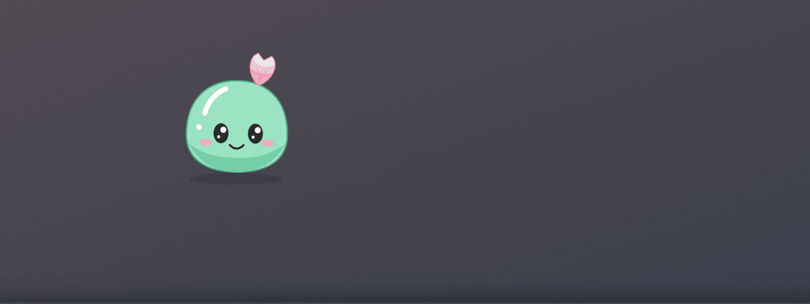

# Lia

English · [Español](README.md)

Lia is a desktop pet for Windows that keeps
[Claude Code](https://claude.com/product/claude-code) company. She floats above your
windows, tells you when Claude needs permission or finishes a task, and lets
you answer without switching windows.

She is for people who run Claude Code in the terminal and leave long tasks
running while they do something else.

<!-- Placeholder: record docs/media/demo.gif and remove this comment. -->


> Independent project. **Not affiliated with or endorsed by Anthropic.**
> Claude and Claude Code are trademarks of their respective owners.

The app's interface is in Spanish.

## Features

- **States.** Lia mirrors what Claude Code is doing: idle, working, "needs
  you" and "done". With several conversations open, the most urgent one wins.
- **Permissions.** When Claude asks permission for a command, a file or a URL,
  Lia shows a card with what it wants to do and two buttons. Lia never decides
  for you: if you do not answer within 60 s, Claude Code asks in the terminal
  as usual.
- **Results.** When a task finishes a ✓ bubble appears; click it to read
  Claude's last message and how long the task took.
- **Interactions.** She follows the cursor with her eyes, bounces when
  touched, gets surprised and then angry if you insist, enjoys being petted
  and gets dizzy if you circle the cursor around her.
- **Island.** A panel hidden at the top centre of the screen: rest the cursor
  on the top edge and it slides down with what happened recently and each
  task's full message. It slides back up when you move away.
- **Puddle.** After a few idle minutes she dozes off, melts into a puddle and
  hides. She comes back on the next event.
- **Sounds.** Short, soft cues generated by the app itself (no audio files).
  They can be muted per category.
- **Unobtrusive.** No taskbar entry, never steals focus, and clicks outside
  her body go through to the window below. She lives in the system tray.

## Installation

1. Download `Lia_0.1.0_x64-setup.exe` and `SHA256SUMS.txt` from
   [Releases](https://github.com/tefosc/lia-slime/releases).
2. Verify the file (see below).
3. Run the installer. It installs for your user only, **without administrator
   rights**, and adds a Start menu shortcut.

Requirements: 64-bit Windows 10 or 11. If your machine lacks WebView2
(Windows 11 ships with it), the installer downloads it from Microsoft.

### The installer is not signed

Code signing on Windows costs money and this is a personal project, so
version 0.1.0 ships **without a digital signature**. Here is what you will see
and what you can do:

- **SmartScreen** will show "Windows protected your PC" with an "unknown"
  publisher. To continue: **More info > Run anyway**. That is the standard
  warning for unsigned or rarely downloaded programs; it says nothing about
  the contents.
- **Verify the SHA-256** before running it. In PowerShell:

  ```powershell
  Get-FileHash .\Lia_0.1.0_x64-setup.exe -Algorithm SHA256
  ```

  The result must match `SHA256SUMS.txt` and the value in the release notes.
  If it does not, do not install it.
- **The binary is built in public.** It is produced by the
  [`release.yml`](.github/workflows/release.yml) GitHub Actions workflow from
  the version tag, with no cache, and the workflow prints the hashes. You can
  read that run's log and compare.
- If that is not enough, [build from source](#building-from-source).

The hash proves the file is the one the workflow produced; it is not a
substitute for a signature and does not protect you if you download
everything from a fake site. Always use this repository's Releases page.

## Claude Code hooks

Lia learns what is going on through Claude Code
[hooks](https://code.claude.com/docs/en/hooks): commands that
Claude Code runs at certain moments. Lia's hooks call `curl.exe` to notify a
local receiver at `127.0.0.1:47615`.

**Install.** On first run Lia opens Settings ("Ajustes"). Click **Instalar o
actualizar hooks**: you will see exactly which lines are added to the `hooks`
section of your `~/.claude/settings.json`, and nothing changes until you click
**Confirmar**. Lia makes a backup first and only touches its own entries.

**Remove.** In Settings, **Quitar hooks**, with the same preview.

Settings opens from the tray icon. To do it by hand, or for the details of
each event, see [docs/hooks.md](docs/hooks.md) (Spanish).

With Lia closed, the hooks fail silently and do not slow Claude Code down.

## Privacy

- **Nothing leaves your machine.** Lia has no servers, telemetry or automatic
  updates, and makes no outbound network requests.
- **What it reads:** each event's name, the session identifier, the
  notification type and, when a task ends, Claude's last message. For a
  permission request, the command, path or URL.
- **What it does not read or store:** your prompts, your code, tool output.
  What it reads lives in memory only and is never written to disk or logs.
- **Private mode:** Lia stops reading Claude's messages and shows statistics
  only.
- Only your preferences and the local token are kept on disk.

Full details in [docs/privacidad.md](docs/privacidad.md) (Spanish).

## Security model and its limits

What Lia protects:

- The receiver listens **on `127.0.0.1` only**: other machines on the network
  cannot reach it.
- Every request must carry a random **token** generated at each start.
  Without it, the request is rejected before being read. A web page cannot
  obtain it.
- Lia **only allows or denies when you click a button**. On timeout, exit or
  failure it answers "no decision" and Claude Code falls back to its normal
  dialog.
- The interface runs under a strict content security policy (no external
  scripts, no `eval`, no network connections) and each window can only call
  the commands it needs.
- Lia changes `settings.json` only with your confirmation, only its own
  entries, and after making a backup.

What it does **not** protect:

- **The token is readable by any program running as your Windows user.** It
  sits in a file in your data folder with the normal `%APPDATA%` permissions.
  Such a program could send fake events to Lia or show a fake permission
  request.
- **Lia is not a barrier against local malware.** A malicious program running
  as you can do far worse without going through Lia (for example, edit your
  `settings.json`).
- Lia shows what Claude Code says it is about to do. Always read the command
  before allowing it; cards flag commands that look dangerous, but that
  detection is a hint, not a guarantee.

To report a vulnerability, see [SECURITY.md](SECURITY.md).

## Building from source

Requirements (Windows):

- Stable [Rust](https://rustup.rs/).
- [Node.js](https://nodejs.org/) 22 or later.
- [pnpm](https://pnpm.io/) (the version is pinned in `package.json`).
- Visual Studio Build Tools with "Desktop development with C++", and
  WebView2, as listed in the
  [Tauri prerequisites](https://tauri.app/start/prerequisites/).

```sh
pnpm install --frozen-lockfile
pnpm tauri dev      # development mode
pnpm tauri build    # installer in src-tauri/target/release/bundle/nsis
```

Tests: `pnpm build`, `pnpm verificar` and `cargo test` inside `src-tauri/`.
To try it without Claude Code, use `scripts/simular-evento.ps1`.

## Project layout

| Folder | Contents |
|---|---|
| `src/` | Interface (React and TypeScript) |
| `src/mascot/` | The character: SVG drawing, animation and reactions |
| `src/estado/`, `src/permisos/`, `src/resultados/` | Sessions, permission cards and results |
| `src/audio/` | Synthesized sounds |
| `src/ajustes/` | Settings window |
| `src-tauri/` | Rust: local receiver, cursor, tray, hook installation |
| `scripts/` | Event simulator, signing and license listing |
| `docs/` | Hooks, privacy, uninstalling, signing and install test script |

Code, comments and commit messages are in Spanish. Built with
[Tauri 2](https://tauri.app/), React and TypeScript.

## Licenses

- **Code:** [MIT](LICENSE).
- **The Lia character** (name, design and art): all rights reserved, with the
  permissions listed in [src/mascot/LICENSE-ARTE.md](src/mascot/LICENSE-ARTE.md).
  You may build, run and redistribute the app with the art unmodified, and
  show screenshots with attribution; you may not use Lia in other products
  without permission.
- **Dependencies:** [docs/licencias-de-terceros.md](docs/licencias-de-terceros.md).

## Credits

- Design, character and development: `<NOMBRE QUE USARÉ EN LA LICENCIA>`.
- Initial scaffold generated with the official `create-tauri-app` template
  (MIT or Apache-2.0).
- Much of the code was written with the help of Claude Code.

This project contains no code copied or adapted from other projects beyond
that template and the listed dependencies.

Contributing: [CONTRIBUTING.md](CONTRIBUTING.md). Changes:
[CHANGELOG.md](CHANGELOG.md).
