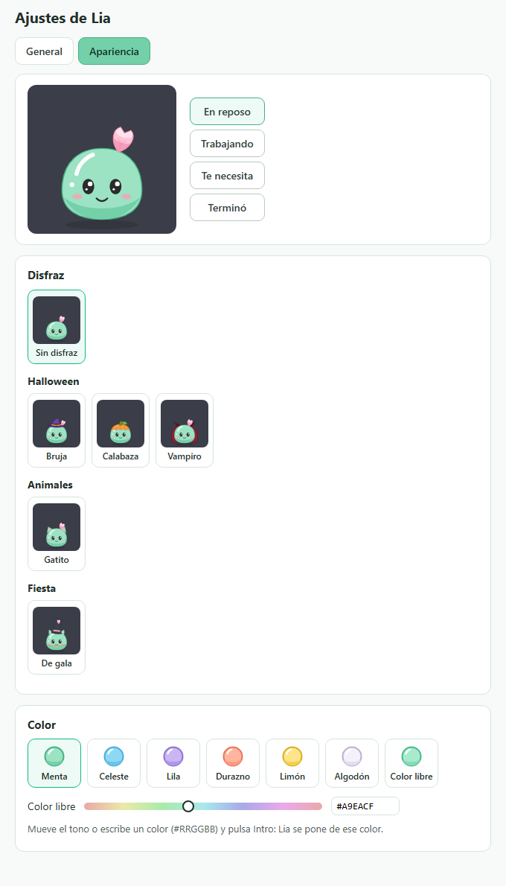

# Lia

[English](README.en.md) · Español

Lia es una mascota de escritorio para Windows que acompaña a
[Claude Code](https://claude.com/product/claude-code). Flota sobre tus ventanas, te
avisa cuando Claude necesita permiso o termina una tarea, y te deja responder
sin cambiar de ventana.

Es para quien usa Claude Code en la terminal y deja tareas largas corriendo
mientras hace otra cosa.


> Proyecto independiente. **No está afiliado a Anthropic ni cuenta con su
> respaldo.** Claude y Claude Code son marcas de sus respectivos dueños.

## Funciones

- **Estados.** Lia refleja lo que hace Claude Code: en reposo, trabajando,
  "te necesita" y "terminó". Con varias conversaciones abiertas, manda la más
  urgente.
- **Sin conexión.** Si el equipo se queda sin red mientras Claude trabaja,
  Lia lo muestra en su burbuja; si Claude se detiene por un error, te avisa.
- **Permisos.** Cuando Claude pide permiso para un comando, un archivo o una
  URL, Lia muestra una tarjeta con lo que quiere hacer y dos botones. Lia
  nunca decide por ti: si no respondes en 60 s, Claude Code pregunta en la
  terminal como siempre.
- **Preguntas.** Si Claude te pregunta algo con opciones, puedes elegir la
  respuesta desde Lia.
- **Resultados.** Al terminar una tarea aparece una burbuja ✓; al pulsarla ves
  el último mensaje de Claude y cuánto tardó.
- **Interacciones.** Sigue el cursor con la mirada, rebota si la tocas, se
  sorprende y se enoja si insistes, se pone contenta con caricias y se marea
  si le das vueltas con el cursor.
- **Isla.** Un panel escondido arriba, en el centro de la pantalla: deja el
  cursor en el borde superior y baja con lo último que pasó y el mensaje
  completo de cada tarea. Sube sola al alejarte.
- **Charquito.** Tras unos minutos sin actividad se adormece, se derrite en un
  charquito y se oculta. Vuelve sola con el siguiente evento.
- **Sonidos.** Avisos y efectos cortos y suaves, generados por la propia app
  (sin archivos de audio). Se pueden silenciar por categoría.
- **Discreta.** No aparece en la barra de tareas, no roba el foco y los clics
  fuera de su cuerpo pasan a la ventana de debajo. Vive en la bandeja.
- **Apariencia.** Elige su color entre seis paletas o con un tono a tu gusto.

## Apariencia

En **Ajustes → Apariencia**, o desde el menú de la bandeja, puedes cambiar el
color de Lia. El cambio es inmediato y no interrumpe nada de lo que esté
pendiente.


- **Paletas:** Menta (la de siempre), Celeste, Lila, Durazno, Limón y
  Algodón.
- **Color libre:** un control de tono, o un color escrito en hexadecimal
  (`#RRGGBB`). Lia se pone de ese color; solo lo aclara un poco si es tan
  oscuro que no se le vería la cara.



Solo se guarda qué paleta y qué disfraz elegiste, nada más.

## Disfraces

Lia puede disfrazarse. Un disfraz son prendas que se pone encima, con su
propio movimiento: no cambia su cuerpo, sus caras ni lo que hace.


- **Bruja** (Halloween): sombrero puntiagudo con el pétalo de adorno. Se
  ladea al moverla y se le cala cuando se enoja.
- **Calabaza** (Halloween): un gorro de calabaza con sus gajos, su rabito y
  su hoja; se ilumina al terminar una tarea.
- **Vampiro** (Halloween): capa que ondea y colmillos.
- **Gatito** (Animales): orejas del color de Lia, bigotes y nariz. Mueve las
  orejas cuando te necesita.
- **De gala** (Fiesta): sombrero de copa con el pétalo de adorno, orejas,
  capa y collar.


Se eligen en **Ajustes → Apariencia** o desde la bandeja. Cada uno propone un
color, que puedes cambiar; se combinan con cualquier paleta. Los clics sobre
el sombrero, la capa, las orejas o los bigotes pasan a la ventana de debajo:
solo el cuerpo de Lia los captura.

Si quieres dibujar uno: [docs/crear-disfraz.md](docs/crear-disfraz.md).

## Instalación

1. Descarga `Lia_0.1.0_x64-setup.exe` y `SHA256SUMS.txt` desde
   [Releases](https://github.com/tefosc/lia-slime/releases).
2. Verifica el archivo (ver abajo).
3. Ejecuta el instalador. Se instala solo para tu usuario, **sin permisos de
   administrador**, y crea un acceso directo en el menú de inicio.

Requisitos: Windows 10 u 11 de 64 bits. Si tu equipo no tiene WebView2
(Windows 11 ya lo trae), el instalador lo descarga de Microsoft.

### El instalador no está firmado

Firmar código en Windows cuesta dinero y este es un proyecto personal, así que
la versión 0.1.0 se publica **sin firma digital**. Esto es lo que verás y lo
que puedes hacer:

- **SmartScreen** mostrará "Windows protegió su PC" con el editor como
  "desconocido". Para continuar: **Más información > Ejecutar de todas
  formas**. Es el aviso normal para programas sin firma o poco descargados; no
  dice nada sobre el contenido.
- **Verifica el SHA-256** antes de ejecutarlo. En PowerShell:

  ```powershell
  Get-FileHash .\Lia_0.1.0_x64-setup.exe -Algorithm SHA256
  ```

  El resultado debe coincidir con el de `SHA256SUMS.txt` y con el que aparece
  en las notas de la release. Si no coincide, no lo instales.
- **El binario se compila en público.** Lo genera el flujo
  [`release.yml`](.github/workflows/release.yml) de GitHub Actions a partir de
  la etiqueta de la versión, sin caché, y el propio flujo imprime los hashes.
  Puedes leer el registro de esa ejecución y comparar.
- Si no te convence, [compila desde el código](#compilar-desde-el-código).

El hash prueba que el archivo es el que produjo el flujo; no sustituye a una
firma ni te protege si descargas todo desde un sitio falso. Usa siempre la
página de Releases de este repositorio.

## Hooks de Claude Code

Lia se entera de lo que pasa por los
[hooks](https://code.claude.com/docs/en/hooks) de Claude Code:
comandos que Claude Code ejecuta en ciertos momentos. Los de Lia llaman a
`curl.exe` para avisar a un receptor local en `127.0.0.1:47615`.

**Instalar.** La primera vez, Lia abre Ajustes. Pulsa **Instalar o actualizar
hooks**: verás exactamente qué líneas se añaden a la sección `hooks` de tu
`~/.claude/settings.json` y nada cambia hasta que pulses **Confirmar**. Lia
guarda antes una copia de respaldo y solo toca sus propias entradas.

**Quitar.** En Ajustes, **Quitar hooks**, con la misma vista previa.

Ajustes se abre desde el icono de la bandeja. Si prefieres hacerlo a mano o
quieres el detalle de cada evento, lee [docs/hooks.md](docs/hooks.md).

Con Lia cerrada, los hooks fallan en silencio y no retrasan a Claude Code.

## Privacidad

- **Nada sale de tu máquina.** Lia no tiene servidores, telemetría ni
  actualizaciones automáticas, y no hace peticiones de red hacia afuera.
- **Qué lee:** el nombre de cada evento, el identificador de la sesión, el
  tipo de notificación y, al terminar una tarea, el último mensaje de Claude.
  En una solicitud de permiso, el comando, la ruta o la URL.
- **Qué no lee ni guarda:** tus prompts, tu código, la salida de las
  herramientas. Lo que lee vive solo en memoria y nunca se escribe en disco ni
  en registros.
- **Modo privado:** Lia deja de leer los mensajes de Claude y solo muestra
  estadísticas.
- En disco solo quedan tus preferencias y el token local.

El detalle completo está en [docs/privacidad.md](docs/privacidad.md).

## Modelo de seguridad y sus límites

Qué protege Lia:

- El receptor escucha **solo en `127.0.0.1`**: otros equipos de la red no
  pueden alcanzarlo.
- Cada petición debe llevar un **token** aleatorio que se genera en cada
  arranque. Sin él, la petición se rechaza antes de leerla. Una página web no
  puede obtenerlo.
- Lia **solo permite o deniega cuando pulsas un botón**. Si pasa el tiempo, se
  cierra o falla, responde "sin decisión" y Claude Code usa su diálogo normal.
- La interfaz tiene una política de contenido estricta (sin scripts externos
  ni `eval`, sin conexiones de red) y cada ventana solo puede usar los
  comandos que necesita.
- Lia modifica `settings.json` solo con tu confirmación, solo sus entradas, y
  con respaldo previo.

Qué **no** protege:

- **El token es legible por cualquier programa que se ejecute con tu usuario
  de Windows.** Está en un archivo de tu carpeta de datos, con los permisos
  normales de `%APPDATA%`. Un programa así podría enviar eventos falsos a Lia
  o mostrar una solicitud de permiso falsa.
- **Lia no es una barrera contra malware local.** Un programa malicioso con tu
  usuario puede hacer cosas mucho peores sin pasar por Lia (por ejemplo,
  editar tu `settings.json`).
- Lia muestra lo que Claude Code le dice que va a hacer. Lee siempre el
  comando antes de permitir; las tarjetas marcan los que parecen peligrosos,
  pero esa detección es una ayuda, no una garantía.

Para reportar una vulnerabilidad, mira [SECURITY.md](SECURITY.md).

## Compilar desde el código

Requisitos (Windows):

- [Rust](https://rustup.rs/) estable.
- [Node.js](https://nodejs.org/) 22 o superior.
- [pnpm](https://pnpm.io/) (la versión está fijada en `package.json`).
- Build Tools de Visual Studio con "Desarrollo para el escritorio con C++" y
  WebView2, como indican los
  [requisitos de Tauri](https://tauri.app/start/prerequisites/).

```sh
pnpm install --frozen-lockfile
pnpm tauri dev      # modo desarrollo
pnpm tauri build    # instalador en src-tauri/target/release/bundle/nsis
```

Pruebas: `pnpm build`, `pnpm verificar` y `cargo test` dentro de `src-tauri/`.
Para probar sin Claude Code, usa `scripts/simular-evento.ps1`.

## Estructura del proyecto

| Carpeta | Contenido |
|---|---|
| `src/` | Interfaz (React y TypeScript) |
| `src/mascot/` | El motor del personaje: animación y reacciones |
| `src/mascotas/` | Los dibujos: cada mascota con sus estilos, y las paletas |
| `src/disfraces/` | Los disfraces, como datos |
| `src/estado/`, `src/permisos/`, `src/resultados/` | Sesiones, tarjetas de permiso y resultados |
| `src/audio/` | Sonidos sintetizados |
| `src/ajustes/` | Ventana de Ajustes |
| `src-tauri/` | Rust: receptor local, cursor, bandeja, instalación de hooks |
| `scripts/` | Simulador de eventos, firma y listado de licencias |
| `docs/` | Hooks, privacidad, desinstalación, firma, guion de prueba y cómo crear un disfraz |

Hecha con [Tauri 2](https://tauri.app/), React y TypeScript.

## Licencias

- **Código:** [MIT](LICENSE).
- **El personaje Lia** (nombre, diseño y arte): todos los derechos reservados,
  con los permisos que detalla [src/mascot/LICENSE-ARTE.md](src/mascot/LICENSE-ARTE.md).
  Puedes compilar, ejecutar y redistribuir la app sin modificar el arte, y
  mostrar capturas con atribución; no puedes usar a Lia en otros productos sin
  permiso.
- **Dependencias:** [docs/licencias-de-terceros.md](docs/licencias-de-terceros.md).

## Créditos

- Diseño, personaje y desarrollo: Alejandro Stéfano Solís Martos.
- Estructura inicial generada con la plantilla oficial `create-tauri-app`
  (MIT o Apache-2.0).
- Buena parte del código se escribió con ayuda de Claude Code.

Este proyecto no incluye código copiado ni adaptado de otros proyectos más
allá de esa plantilla y de las dependencias listadas.

Cómo contribuir: [CONTRIBUTING.md](CONTRIBUTING.md). Cambios:
[CHANGELOG.md](CHANGELOG.md).
